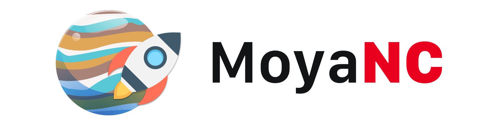

<p align="center">

</p>

<H4 align="center">
Simple Swift Requests
</H4>

<p align="center">
<br>
<a href="https://github.com/BarredEwe/MoyaNetworkClient/releases/latest"></a>
<a href="https://developer.apple.com/swift"></a> 
<a href="https://cocoapods.org/pods/MoyaNetworkClient"></a>
<a href="https://developer.apple.com/"></a>
<br/>
<a href="https://www.codefactor.io/repository/github/barredewe/moyanetworkclient"></a>
<a href="https://travis-ci.com/BarredEwe/MoyaNetworkClient"></a>
<a href="https://github.com/apple/swift-package-manage"></a>
</p>

---

## Introduction

MoyaNC is an abstraction over abstraction (thanks to [Moya](https://github.com/Moya/Moya) 🖤🖤🖤) allowing you not to worry about the data mapping layer and just use your requests. The Codable protocol is used for JSON data mapping, all that is needed is to comply with this protocol and specify the type! Additionally, there is the ability to easily and simply cache any requests.

## Example

To run the example project, clone the repo, and run `pod install` from the Example directory first. After some setup, using MoyaNC is really simple. You can access an API like this:

```swift
client = DefaultMoyaNC()

// type 'Test' must be Codable
client.request(.zen) { (result: Result<Test>) in
    switch result {
    case let .success(test):
        // do something with the finished object
    case let .failure(error):
        // do something with error
    }
}
```
That's a basic example. Many API requests need parameters.

## Extensions

Moya provides extensions for:
- **Cache**: Allows you to cache request data using a flexible caching policy. 
Need to add `pod 'MoyaNetworkClient/Cache'` to the Podfile.
- **FutureResult**: A Future is used to retrieve the result of a concurrent, asynchronous operation. It is a key building block in asynchronous, non-blocking code. 
Need to add `pod 'MoyaNetworkClient/Future'` to the Podfile.

### Cache

A simple example to use caching requests:

Definition of caching at the API level:
```swift
enum TestAPI {
    case .zen
}

extension TestAPI: MoyaTargetType, CacheTarget {
    var cachePolicy: MoyaCachePolicy {
        return .returnCacheDataElseLoad
    }
}
```
Definition of caching at the request level:
```swift
client = DefaultMoyaNC()

client.request(.zen, cache: .returnCacheDataElseLoad)
```

### FutureResult

Here is an example of the kinds of complex logic possible with Futures:

```swift
client = DefaultMoyaNC()

// type 'Test' must be Codable
client.request(.zen)
    .observeSuccess { (test: Test) in /* do something with the finished object */ }
    .observeError { error in /* do something with error */) }
    .execute()
```

## Installation
### CocoaPods

For MoyaNetworkClient, use the following entry in your Podfile:

```rb
pod 'MoyaNetworkClient'
```

Then run `pod install`.

In any file you'd like to use Moya in, don't forget to
import the framework with `import MoyaNetworkClient`.

### Swift Package Manager

To integrate using Apple's Swift package manager, add the following as a dependency to your `Package.swift`:

```swift
.package(url: "https://github.com/BarredEwe/MoyaNetworkClient.git", .upToNextMajor(from: "1.0.0"))
```

and then specify `"MoyaNetworkClient"` as a dependency of the Target in which you wish to use MoyaNetworkClient.

## Author

BarredEwe, barredEwe@gmail.com

## License

MoyaNC is released under an MIT license. See License for more information.
